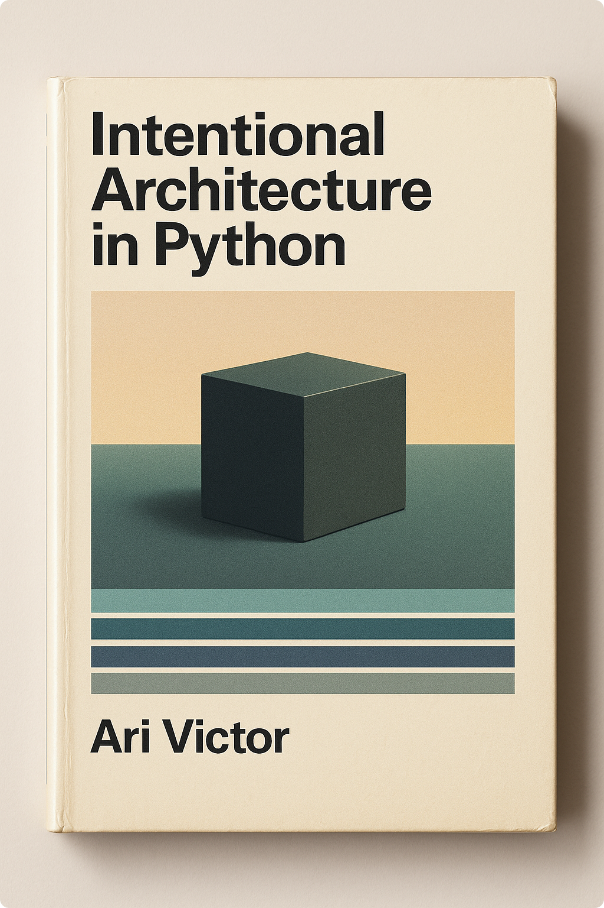

# Intentional Architecture in Python
A Pragmatic Guide to Layers, Patterns, and Design Decisions

---

You know how to write code that works. But somewhere between "it runs" and "it's maintainable," things fall apart. Functions grow unwieldy. Classes become tangled. Changes that should be simple ripple across your codebase. You've heard terms like Clean Architecture and Domain-Driven Design, but when you tried to learn them, the gap between theory and practice felt impossibly wide.

This book bridges that gap.

**Intentional Architecture in Python** teaches you to think like an architect. Not by memorising patterns, but by understanding the decisions behind them. You'll learn to recognise what needs to change in your system and protect it from what doesn't. To separate business logic from technical details. To write code that's easier to test, modify, and reason about.

Through a practical running example—a gym class booking system—you'll discover:
- **Why architecture matters** and when "good enough" beats "perfect"
- **SOLID principles** that actually make sense in context
- **Test-Driven Development** as a design tool, not just a testing practice
- **Clean Architecture layers** and how to organize code across them
- **Domain modeling** that reflects real business rules
- **Use cases** that orchestrate without contaminating domain logic
- **Ports and adapters** that let you swap infrastructure without touching core code

Every chapter builds on the last. Every pattern is motivated by a real problem. Every "rule" comes with a "when not to use it."

By the end, you won't just know the patterns, you'll understand when to apply them, when to skip them, and how to make architectural decisions with intention.

**This book is for developers who want to move beyond tutorials and understand the fundamentals that last.**

  

  <a href="">Buy on Amazon</a> | <a href="">Buy on Lulu</a> | <a href="#contents">Read free online</a>

## Contents

* [Introduction](book/0-introduction.md)

### Part I: Foundations (Build the Mindset)

* Chapter 1: [Philosophy](book/1-philosophy.md)
* Chapter 2: [SOLID Principles](book/2-solid.md)

### Part II: Test-Driven Mindset

* Chapter 3: [Test-Driven Development](book/3-tdd.md)

### Part III: Architectural Patterns (Build the Structure)

* Chapter 4: [Layers & Clean Architecture](book/4-layers.md)
* Chapter 5: [Domain Modeling (DDD)](book/5-domain.md)
* Chapter 6: [Use Cases & Application Layer](book/6-use-cases.md)
* Chapter 7: [Ports & Adapters (Hexagonal Architecture)](book/7-ports-adapters.md)

### Part IV: Integration (Bring It All Together)

* Chapter 8: [Putting It All Together](book/8-putting-it-together.md)
* Chapter 9: [Conclusion](book/9-conclusion.md)

### Appendices (Advanced Topics)

* Appendix A: [Factory Pattern for Complex Creation](book/appendix-a-factory-pattern.md)
* Appendix A: [Repository Query Patterns](book/appendix-a-repository-query-patterns.md)
* Appendix A: [Validation Strategies Across Layers](book/appendix-a-validation-strategies.md)
* Appendix A: [Domain Events](book/appendix-a-domain-events.md)
* Appendix B: [Unit of Work Pattern](book/appendix-b-unit-of-work.md)
* Appendix A: [Aggregate Design & Boundary Decisions](book/appendix-a-aggregate-design.md)

## License

This book is licensed under [CC BY-NC-ND 4.0](https://creativecommons.org/licenses/by-nc-nd/4.0/).

**Copyright © 2025 Ari Laverty**

You are free to share this work for non-commercial purposes with attribution. You may not create derivative works or use this material commercially without permission.

See [LICENSE](LICENSE) for full terms.
