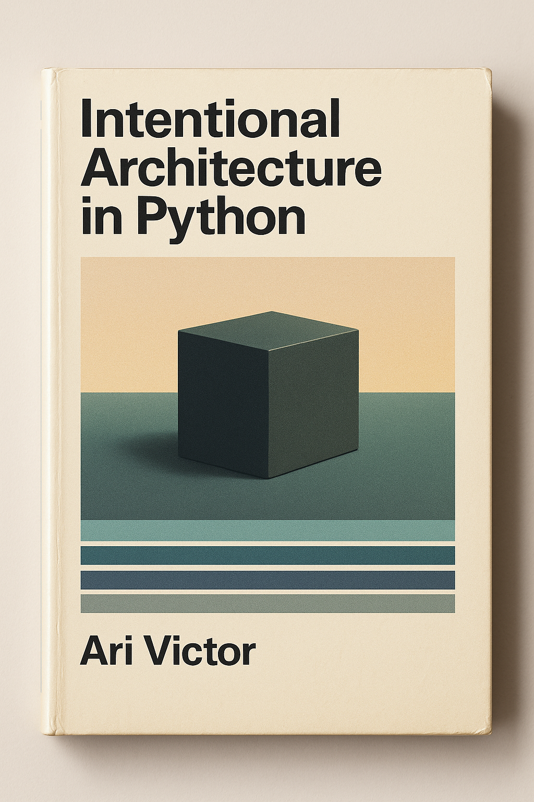

# Intentional Architecture in Python

Your scripts became a system you're afraid to touch. Learn architecture by building a complete Python application from domain to database. Master DDD, layered design, and hexagonal patterns through real development. Practical decisions over dogma.

  

  <a href="">Buy on Amazon</a> | <a href="">Buy on Lulu</a> | <a href="#contents">Read free online</a>

## Contents

* [Introduction](book/0-introduction.md)
* [Philosophy: Architecture as Mindset](book/1-philosophy.md)
* [SOLID](book/2-solid.md)
* [Layers](book/3-layers.md)
* [Entities](book/4-entities.md)
* [Aggregates](book/5-aggregates.md)
* [Use Cases](book/6-use-cases.md)
* [Ports](book/7-ports.md)
* [Adapters](book/8-adapters.md)

## License

This book is licensed under [CC BY-NC-ND 4.0](https://creativecommons.org/licenses/by-nc-nd/4.0/).

**Copyright © 2025 Ari Laverty**

You are free to share this work for non-commercial purposes with attribution. You may not create derivative works or use this material commercially without permission.

See [LICENSE](LICENSE) for full terms.
